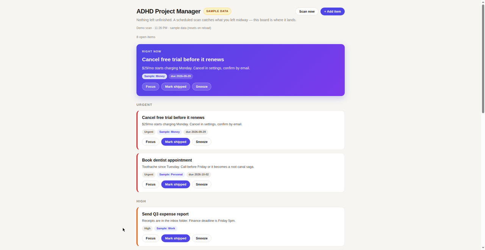

# ADHD Project Manager

> **Built for Muse.** A scheduled scan reads your Muse threads, catches everything you left midway, and puts it on one prioritized board that nudges you until it's actually shipped.

## The story

I have ADHD. My ideas come in bursts and my threads pile up — a job application half-drafted here, a plan with no next step there, a promise I made three chats ago that quietly died. I kept losing things not because I didn't care, but because they shared a scroll with everything else.

So I built the thing I needed: a project manager that watches my conversations, pulls every unfinished thread into one place, and orders them by what actually matters right now. In my words, its whole job is to **"catch the things I left midway."**

## The problem

Chat threads are where work goes to be forgotten. A todo list you have to maintain by hand is a second job — and for an ADHD brain, a second job is a fantasy. The system has to do the noticing.

## How it works

Three steps, on a loop:

1. **Scan** — on a schedule, an agent reads every thread (main chat + side chats; email and calendar are context only) and finds open loops: started-but-unfinished work, unconfirmed commitments, threads that went quiet while waiting on you.
2. **Board** — open loops land on one prioritized board. The top item becomes the "Right now" hero. Each card shows where it came from, so you can jump straight back to context.
3. **Nudge** — items stay on the board until you confirm they're shipped. You can snooze with a comeback date. *Produced is not shipped* — only your confirmation clears an item.

## Try the demo

Open `board/index.html` in a browser — it runs on fictional sample data, no setup needed.

Or enable **GitHub Pages** on this repo (Settings → Pages → Deploy from branch) for a live demo link.

## Run the scan yourself

The scanner's brain is plain markdown — no code required:

- [`prompts/scan.md`](prompts/scan.md) — what counts as an open loop, how to output items, the dedup and "shipped" rules
- [`prompts/prioritization.md`](prompts/prioritization.md) — the urgency rubric, most-urgent-first

Paste the scan prompt into any LLM, point it at your own conversation exports, and have it emit items matching [`data/schema.md`](data/schema.md). Drop the resulting JSON into the board and it renders.

## Make it yours

| Tweak | Where |
|---|---|
| What counts as an open loop | `prompts/scan.md` |
| What "urgent" means | `prompts/prioritization.md` |
| Item fields the board understands | `data/schema.md` |
| Board colors, labels, layout | `board/index.html` (search `THEME`) |
| How often it scans | your scheduler (cron, etc.) |

## Why Muse

The full system is Muse-native, and that's the point of this repo:

- **Scheduled background scans** — the scan runs on its own every morning; nothing to remember to run.
- **Cross-chat context** — the scanner sees all your threads, which is where the open loops actually live.
- **Artifacts as UI** — the board is a living web app inside the conversation, not a screenshot.

A generic task board exists a thousand times on GitHub. A board that reads your AI chats is the differentiator.

## Repurpose it elsewhere

Don't use Muse? The repo separates cleanly at two seams:

1. **Data in** — the board renders any JSON matching [`data/schema.md`](data/schema.md). Feed it from anything: another assistant's output, a script over your chat exports, a form you fill in by hand.
2. **Scan prompt** — `prompts/scan.md` runs in any LLM. Point it at any conversation export and it produces board-ready items.

You lose the automatic scheduled scans (that's the Muse-native part), but the board + the methodology travel anywhere.

## Project status

- [x] Muse-native system (private, in daily use)
- [x] Static board + sample data + prompts (this repo)
- [ ] One-click import of chat exports
- [ ] "Snooze until" natural-language parsing in the demo board

## License

MIT — see [LICENSE](LICENSE). Use it, fork it, make it yours.

---

Built by Lorisca, with Muse as the pair programmer.
